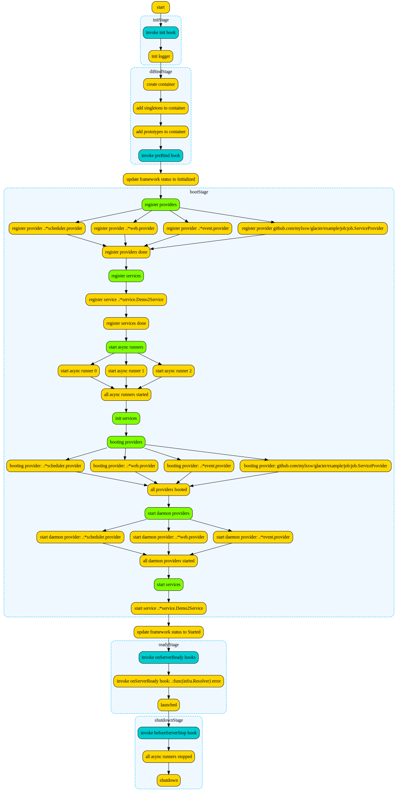

# Glacier Framework

[中文文档](README_CN.md) | English

Glacier is a modular Go application development framework built on dependency injection, powered by the [go-ioc](https://github.com/mylxsw/go-ioc) container. It helps you build well-structured and maintainable Go applications.

```bash
go get github.com/mylxsw/glacier
```

API Documentation: https://pkg.go.dev/github.com/mylxsw/glacier

## Table of Contents

- [Quick Start](#quick-start)
- [Core Concepts](#core-concepts)
  - [Dependency Injection](#dependency-injection)
  - [Provider (Module)](#provider-module)
  - [Service (Background Service)](#service-background-service)
- [Web Development](#web-development)
  - [Basic Usage](#basic-usage)
  - [Controllers](#controllers)
  - [Middleware](#middleware)
  - [Handler Return Values](#handler-return-values)
  - [Web Configuration Options](#web-configuration-options)
- [Event System](#event-system)
- [Scheduled Tasks](#scheduled-tasks)
- [Logging](#logging)
- [Graceful Shutdown](#graceful-shutdown)
- [Complete Example](#complete-example)
- [Related Projects](#related-projects)

## Quick Start

Here's a minimal runnable Glacier application - an HTTP server that returns JSON:

```go
package main

import (
    "github.com/mylxsw/glacier/listener"
    "github.com/mylxsw/glacier/starter/app"
    "github.com/mylxsw/glacier/infra"
    "github.com/mylxsw/glacier/web"
)

func main() {
    app.MustStart("1.0", 3, func(ins *app.App) error {
        // Add --listen flag, default :8080
        ins.AddStringFlag("listen", ":8080", "HTTP listen address")

        // Register Web module
        ins.Provider(web.Provider(
            listener.FlagContext("listen"),
            web.SetRouteHandlerOption(func(cc infra.Resolver, router web.Router, mw web.RequestMiddleware) {
                router.Get("/hello", func(ctx web.Context) web.Response {
                    name := ctx.InputWithDefault("name", "World")
                    return ctx.JSON(web.M{"message": "Hello, " + name})
                })
            }),
        ))

        return nil
    })
}
```

After running, visit `http://localhost:8080/hello?name=Glacier` to see the JSON response.

> The three parameters of `app.MustStart` are: version number, number of async task runners, and initialization function.

### Two Ways to Start

```go
// Method 1: All-in-one
app.MustStart("1.0", 3, func(ins *app.App) error {
    // Initialize configuration...
    return nil
})

// Method 2: Step-by-step creation, suitable for scenarios requiring finer control
ins := app.Create("1.0", 3)
// Configure ins...
app.MustRun(ins)
```

## Core Concepts

Glacier is built around three core concepts: **Dependency Injection**, **Provider**, and **Service**. Understanding them means mastering the entire framework.

### Dependency Injection

Dependency injection is the foundation of Glacier. The framework automatically manages object creation and dependencies through an IoC (Inversion of Control) container. You just tell the container "how to create objects", and the container will automatically assemble dependencies when needed.

Two core interfaces:

| Interface | Purpose | Analogy |
|-----------|---------|---------|
| `infra.Binder` | Register object creation methods | "Tell the factory how to make things" |
| `infra.Resolver` | Get object instances from container | "Get things from the factory" |

#### Binder: Register Objects

```go
// Singleton: created only once in the application lifecycle
binder.Singleton(func() *Database {
    return &Database{DSN: "localhost:3306"}
})

// Supports automatic dependency injection: parameters provided by container
binder.Singleton(func(conf *Config) (*sql.DB, error) {
    return sql.Open("mysql", conf.MySQLURI)
})

// Prototype: creates new instance every time
binder.Prototype(func() *RequestLogger {
    return &RequestLogger{CreatedAt: time.Now()}
})

// BindValue: bind a concrete value to specified key
binder.BindValue("app_name", "MyApp")
```

#### Resolver: Get Objects

```go
// Resolve: execute function, parameters auto-injected by container
resolver.Resolve(func(db *sql.DB) {
    db.Query("SELECT 1")
})

// Call: similar to Resolve, but supports getting return values
results, err := resolver.Call(func(db *sql.DB) (string, error) {
    return "ok", nil
})

// AutoWire: automatically inject struct fields (requires autowire tag)
type UserService struct {
    DB     *sql.DB    `autowire:"@"`    // Inject by type
    Config *Config    `autowire:"@"`    // Inject by type
}
svc := &UserService{}
resolver.AutoWire(svc)
// Now svc.DB and svc.Config are automatically assigned
```

#### A Complete Dependency Injection Example

```go
app.MustStart("1.0", 3, func(ins *app.App) error {
    // Step 1: Register config object creation method
    ins.MustSingleton(func(c infra.FlagContext) *Config {
        return &Config{
            DBAddr: c.String("db-addr"),
        }
    })

    // Step 2: Register database connection (automatically depends on Config above)
    ins.MustSingleton(func(conf *Config) (*sql.DB, error) {
        return sql.Open("mysql", conf.DBAddr)
    })

    // Step 3: Register UserRepo (automatically depends on sql.DB above)
    ins.MustSingleton(func(db *sql.DB) *UserRepo {
        return &UserRepo{db: db}
    })

    // When used, container will automatically resolve the entire dependency chain:
    // Config -> sql.DB -> UserRepo
    return nil
})
```

### Provider (Module)

Provider is the core mechanism for implementing modularity in Glacier. Each independent functional module is encapsulated as a Provider by implementing the `infra.Provider` interface.

#### Basic Provider

The simplest Provider only needs to implement the `Register` method:

```go
package user

type Provider struct{}

func (Provider) Register(binder infra.Binder) {
    binder.Singleton(func(db *sql.DB) *UserRepo {
        return &UserRepo{db: db}
    })
}
```

Register to application:

```go
ins.Provider(user.Provider{})
```

#### Provider Extension Interfaces

Providers can gain additional capabilities by implementing extra interfaces:

| Interface | Method | Purpose |
|-----------|--------|---------|
| `ProviderBoot` | `Boot(resolver Resolver)` | Execute initialization logic after all modules are registered |
| `DaemonProvider` | `Daemon(ctx, resolver)` | Asynchronous background tasks (e.g., HTTP server) |
| `ProviderAggregate` | `Aggregates() []Provider` | Declare dependent sub-modules, framework will load them first |

**ProviderBoot** — Execute initialization at startup:

```go
func (Provider) Boot(resolver infra.Resolver) {
    // All modules are registered at this point, safe to use any dependencies
    resolver.MustResolve(func(db *sql.DB) {
        // Execute database migrations and other one-time tasks
    })
}
```

**DaemonProvider** — Run background tasks:

```go
func (Provider) Daemon(ctx context.Context, resolver infra.Resolver) {
    resolver.MustResolve(func(server *grpc.Server) {
        // Start gRPC server (runs asynchronously, doesn't block other modules)
        server.Serve(listener)
    })
}
```

**ProviderAggregate** — Aggregate sub-modules:

```go
func (Provider) Aggregates() []infra.Provider {
    return []infra.Provider{
        web.Provider(
            listener.FlagContext("listen"),
            web.SetRouteHandlerOption(routes),
        ),
    }
}
```

#### Conditional Loading (ShouldLoad)

Providers support conditional loading:

```go
func (Provider) ShouldLoad(conf *Config) bool {
    return conf.EnableFeatureX  // Returns false means don't load this module
}
```

> Note: When `ShouldLoad` executes, the current module's `Register` hasn't run yet, so it can only depend on globally registered objects (e.g., config objects).

#### Loading Priority

Control module loading order, smaller numbers load earlier (default is 1000):

```go
func (Provider) Priority() int {
    return 10  // Loads earlier than default 1000
}
```

### Service (Background Service)

Service represents a continuously running background task. Only needs to implement `Start() error` method:

```go
type HealthChecker struct {
    stopped chan struct{}
}

func (s *HealthChecker) Start() error {
    for {
        select {
        case <-s.stopped:
            return nil
        default:
            // Perform health check...
            time.Sleep(30 * time.Second)
        }
    }
}

// All methods below are optional

func (s *HealthChecker) Init(resolver infra.Resolver) error {
    s.stopped = make(chan struct{})
    return nil  // Executes before Start, used for initialization
}

func (s *HealthChecker) Stop() {
    close(s.stopped)  // Called when shutdown signal received
}

func (s *HealthChecker) Reload() {
    // Called when reload signal received (optional)
}

func (s *HealthChecker) Name() string {
    return "health-checker"  // Used for log identification (optional)
}
```

Register Service:

```go
ins.Service(&HealthChecker{})
```

Services also support `ShouldLoad` and `Priority` interfaces.

## Web Development

Glacier has a built-in web development framework based on [Gorilla Mux](https://github.com/gorilla/mux), integrated as a `DaemonProvider` and managed uniformly with other modules.

### Basic Usage

```go
ins.Provider(web.Provider(
    listener.FlagContext("listen"),  // Get listen address from command-line flag
    web.SetRouteHandlerOption(func(cc infra.Resolver, router web.Router, mw web.RequestMiddleware) {
        router.Get("/users", listUsers)
        router.Post("/users", createUser)
        router.Get("/users/{id}", getUser)
        router.Put("/users/{id}", updateUser)
        router.Delete("/users/{id}", deleteUser)
    }),
))
```

**Listener builders** have three ways:

```go
listener.FlagContext("listen")      // Read address from command-line flag
listener.Default(":8080")           // Fixed address
listener.Exist(existingListener)    // Use existing net.Listener
```

### Controllers

For more complex applications, it's recommended to use controllers to organize routes. Controllers need to implement the `web.Controller` interface:

```go
type UserController struct {
    resolver infra.Resolver
}

func NewUserController(cc infra.Resolver) web.Controller {
    return &UserController{resolver: cc}
}

// Register all routes for this controller
func (c *UserController) Register(router web.Router) {
    router.Group("/users", func(router web.Router) {
        router.Get("/", c.List)
        router.Post("/", c.Create)
        router.Get("/{id}", c.Get)
        router.Delete("/{id}", c.Delete)
    })
}

func (c *UserController) List(ctx web.Context) web.Response {
    page := ctx.IntInput("page", 1)
    return ctx.JSON(web.M{"page": page, "users": []string{}})
}

func (c *UserController) Create(ctx web.Context, userRepo *UserRepo) (*User, error) {
    var form UserForm
    if err := ctx.Unmarshal(&form); err != nil {
        return nil, web.WrapJSONError(err, http.StatusBadRequest)
    }
    return userRepo.Create(form)
}

func (c *UserController) Get(ctx web.Context) web.M {
    return web.M{"id": ctx.PathVar("id")}
}

func (c *UserController) Delete(ctx web.Context, userRepo *UserRepo) error {
    return userRepo.DeleteByID(ctx.PathVar("id"))
}
```

Mount controllers in route registration function:

```go
web.SetRouteHandlerOption(func(cc infra.Resolver, router web.Router, mw web.RequestMiddleware) {
    router.WithMiddleware(mw.AccessLog(log.Default())).
        Controllers("/api",
            NewUserController(cc),
            NewOrderController(cc),
        )
})
```

### Middleware

Middleware is obtained through the `web.RequestMiddleware` parameter and supports chaining:

```go
func routes(cc infra.Resolver, router web.Router, mw web.RequestMiddleware) {
    // Combine multiple middleware
    router.WithMiddleware(
        mw.AccessLog(log.Default()),  // Access logging
        mw.CORS("*"),                 // CORS support
        mw.AuthHandler(func(ctx web.Context, typ, credential string) error {
            // Authentication logic
            return nil
        }),
    ).Controllers("/api", controllers...)
}
```

### Handler Return Values

Glacier's handlers are very flexible, supporting multiple return value patterns, with the framework automatically handling serialization:

```go
// Return web.Response — Full control over response format
func(ctx web.Context) web.Response {
    return ctx.JSON(web.M{"key": "value"})       // JSON response
    return ctx.JSONWithCode(data, 201)            // JSON + custom status code
    return ctx.YAML(data)                         // YAML response
    return ctx.Raw(func(w http.ResponseWriter) {  // Raw HTTP response
        w.Write([]byte("raw"))
    })
    return ctx.HTML("template", data)             // HTML template rendering
    return ctx.Redirect("/other", 302)            // Redirect
    return ctx.JSONError("not found", 404)        // Error response
}

// Return any struct/map — Auto-serialized to JSON
func(ctx web.Context) web.M {
    return web.M{"hello": "world"}
}
func(ctx web.Context) *User {
    return &User{Name: "test"}
}

// Return error — Auto-converted to error response when non-nil
func(ctx web.Context) error {
    return errors.New("something went wrong")
}

// Return (struct, error) — Supports both normal and error cases
func(ctx web.Context, repo *UserRepo) (*User, error) {
    return repo.FindByID(ctx.PathVar("id"))
}

// Return string — Used directly as response body
func(ctx web.Context) string {
    return "Hello, World"
}

// Handler parameters support automatic dependency injection
func(ctx web.Context, db *sql.DB, repo *UserRepo) web.Response {
    // db and repo automatically injected by container
    ...
}
```

### Web Configuration Options

```go
web.Provider(
    listener.FlagContext("listen"),
    web.SetRouteHandlerOption(routes),                        // Route registration
    web.SetExceptionHandlerOption(exceptionHandler),          // Global exception handling
    web.SetMuxRouteHandlerOption(muxHandler),                 // Direct Gorilla Mux manipulation
    web.SetIgnoreLastSlashOption(true),                       // Ignore trailing /
    web.SetHttpReadTimeoutOption(10 * time.Second),           // Read timeout
    web.SetHttpWriteTimeoutOption(30 * time.Second),          // Write timeout
    web.SetHttpIdleTimeoutOption(120 * time.Second),          // Idle timeout
    web.SetMultipartFormMaxMemoryOption(32 << 20),            // Form max memory (32MB)
)
```

## Event System

Glacier provides a publish/subscribe event system for decoupled communication between modules.

### Define Events

```go
type UserCreatedEvent struct {
    UserID   int
    Username string
}

// Implement AsyncEvent interface for async event handling (optional)
func (e UserCreatedEvent) Async() bool { return true }
```

### Register Listeners

```go
ins.Provider(event.Provider(
    func(cc infra.Resolver, listener event.Listener) {
        // Listener function parameter type determines which events it listens to
        listener.Listen(func(evt UserCreatedEvent) {
            log.Infof("New user registered: %s", evt.Username)
            // Send welcome email, etc...
        })
    },
    // Use memory event store (async mode, queue length 100)
    event.SetStoreOption(func(cc infra.Resolver) event.Store {
        return event.NewMemoryEventStore(true, 100)
    }),
))
```

### Publish Events

Get `event.Publisher` through dependency injection, publish events anywhere in the application:

```go
// Publish in handler
func(ctx web.Context, publisher event.Publisher) web.Response {
    publisher.Publish(UserCreatedEvent{UserID: 1, Username: "test"})
    return ctx.JSON(web.M{"status": "ok"})
}

// Publish in async task
ins.Async(func(publisher event.Publisher) {
    publisher.Publish(UserCreatedEvent{UserID: 1, Username: "test"})
})
```

### Event Storage Backends

- **Memory backend** (built-in): `event.NewMemoryEventStore(async, queueSize)`
- **Redis backend**: [redis-event-store](https://github.com/mylxsw/redis-event-store), provides event persistence support to avoid event loss on application crash

## Scheduled Tasks

Use `scheduler.Provider` to register scheduled tasks based on cron expressions:

```go
ins.Provider(scheduler.Provider(
    func(cc infra.Resolver, creator scheduler.JobCreator) {
        // Execute every 10 seconds
        creator.MustAdd("cleanup-job", "@every 10s", func() {
            log.Info("Executing cleanup task...")
        })

        // Execute daily at 2 AM, and execute once when server starts
        creator.MustAddAndRunOnServerReady("daily-report", "0 2 * * *", func() {
            log.Info("Generating daily report...")
        })

        // Use WithoutOverlap to prevent task overlap:
        // If previous execution hasn't completed, current schedule will be skipped
        creator.MustAdd("slow-job", "@every 30s",
            scheduler.WithoutOverlap(func() {
                // Potentially long-running task
            }).SkipCallback(func() {
                log.Warning("slow-job skipped: previous run not completed")
            }),
        )
    },
))
```

### Distributed Locks

In cluster deployments, distributed locks can ensure scheduled tasks execute only once across all nodes:

```go
scheduler.Provider(
    func(cc infra.Resolver, creator scheduler.JobCreator) { ... },
    scheduler.SetLockManagerOption(func(cc infra.Resolver) scheduler.LockManagerBuilder {
        return func(name string) scheduler.LockManager {
            // Return distributed lock implementation (e.g., Redis-based lock)
            return redisLock.New(redisClient, name, 10*time.Minute)
        }
    }),
)
```

> Reference implementation: [mylxsw/distribute-locks](https://github.com/mylxsw/distribute-locks)

## Logging

Glacier defines the `infra.Logger` interface for logging abstraction, supporting multiple logging backends:

```go
// Use standard library logger (built-in)
ins.WithLogger(log.StdLogger())

// Use standard library logger, but filter DEBUG level
ins.WithLogger(log.StdLogger(log.DEBUG))

// Use asteria logging framework (default)
// import asteria "github.com/mylxsw/asteria/log"
ins.WithLogger(asteria.Module("glacier"))
```

You can also wrap any third-party logging library by implementing the `infra.Logger` interface:

```go
type Logger interface {
    Debug(v ...interface{})
    Debugf(format string, v ...interface{})
    Info(v ...interface{})
    Infof(format string, v ...interface{})
    Error(v ...interface{})
    Errorf(format string, v ...interface{})
    Warning(v ...interface{})
    Warningf(format string, v ...interface{})
    Critical(v ...interface{})    // Critical error, triggers application exit
    Criticalf(format string, v ...interface{})
}
```

## Graceful Shutdown

Glacier automatically listens for system signals (SIGINT, SIGTERM), and executes all registered shutdown handlers in sequence after receiving signals.

```go
ins := app.Create("1.0", 3)
// Set graceful shutdown timeout (force exit after timeout)
ins.WithShutdownTimeoutFlag(5 * time.Second)

// Register shutdown handler in Provider
func (Provider) Boot(resolver infra.Resolver) {
    resolver.MustResolve(func(gf infra.Graceful) {
        gf.AddShutdownHandler(func() {
            // Close database connections, release resources, etc.
        })
    })
}
```

## Complete Example

The following demonstrates a complete application structure including web service, scheduled tasks, and event system:

```
myapp/
├── main.go               # Application entry
├── config/
│   └── config.go          # Configuration definition
├── api/
│   ├── provider.go        # Web module Provider
│   └── controller/
│       └── user.go        # User controller
└── job/
    └── provider.go        # Scheduled task Provider
```

**main.go**

```go
func main() {
    app.MustStart("1.0", 3, func(ins *app.App) error {
        ins.WithLogger(log.StdLogger())
        ins.WithYAMLFlag("conf")                           // Support --conf to load YAML config file
        ins.WithShutdownTimeoutFlag(5 * time.Second)
        ins.AddStringFlag("listen", ":8080", "HTTP listen address")

        // Register configuration (PreBind ensures injection before all Providers)
        ins.PreBind(func(binder infra.Binder) {
            binder.MustSingleton(func(c infra.FlagContext) *config.Config {
                return &config.Config{Listen: c.String("listen")}
            })
        })

        // Register functional modules
        ins.Provider(api.ServiceProvider{})
        ins.Provider(job.ServiceProvider{})
        ins.Provider(event.Provider(
            func(cc infra.Resolver, listener event.Listener) {
                listener.Listen(func(evt UserCreatedEvent) {
                    log.Infof("New user: %s", evt.Username)
                })
            },
            event.SetStoreOption(func(cc infra.Resolver) event.Store {
                return event.NewMemoryEventStore(true, 100)
            }),
        ))

        return nil
    })
}
```

**api/provider.go**

```go
type ServiceProvider struct{}

func (s ServiceProvider) Aggregates() []infra.Provider {
    return []infra.Provider{
        web.Provider(
            listener.FlagContext("listen"),
            web.SetRouteHandlerOption(s.routes),
            web.SetExceptionHandlerOption(func(ctx web.Context, err interface{}) web.Response {
                return ctx.JSONWithCode(web.M{"error": fmt.Sprintf("%v", err)}, 500)
            }),
        ),
    }
}

func (s ServiceProvider) routes(cc infra.Resolver, router web.Router, mw web.RequestMiddleware) {
    router.WithMiddleware(mw.AccessLog(log.Default()), mw.CORS("*")).
        Controllers("/api", controller.NewUserController(cc))
}

func (s ServiceProvider) Register(binder infra.Binder) {}
```

> More example code can be found in the [example](https://github.com/mylxsw/glacier/tree/main/example) directory.

## Execution Flow



## Related Projects

**Integration & Extensions**

- [Eloquent ORM](https://github.com/mylxsw/eloquent) — Laravel-inspired Go ORM framework
- [redis-event-store](https://github.com/mylxsw/redis-event-store) — Redis-based event persistence backend
- [distribute-locks](https://github.com/mylxsw/distribute-locks) — Redis-based distributed locks
- [giris](https://github.com/mylxsw/giris) — [Iris Web Framework](https://www.iris-go.com/) adapter

**Projects Built with Glacier**

- [WebDAV Server](https://github.com/mylxsw/webdav-server) — WebDAV server with LDAP support
- [Adanos Alert](https://github.com/mylxsw/adanos-alert) — Open-source alerting platform
- [Healthcheck](https://github.com/mylxsw/healthcheck) — Health check alerting service
- [Sync](https://github.com/mylxsw/sync) — Cross-server file synchronization
- [Tech Share](https://github.com/mylxsw/tech-share) — Team technical sharing management
- [Universal Exporter](https://github.com/mylxsw/universal-exporter) — Universal Prometheus Exporter
- [Graphviz Server](https://github.com/mylxsw/graphviz-server) — Graphviz diagram generation web service
- [MySQL Guard](https://github.com/mylxsw/mysql-guard) — MySQL long transaction detection and deadlock alerting
- [Password Server](https://github.com/mylxsw/password-server) — Random password generation service
